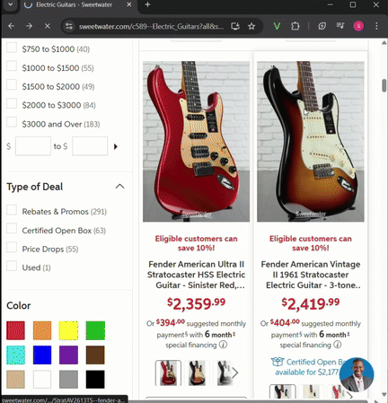

# viewLater - A Personal Bookmark Manager Extension

This extension acts as a personal bookmark manager, allowing you to store links with custom titles and notes. It also gives you the option to group them for easy access.



---

## Table of Contents
* [Installation](#installation)
* [Usage](#usage)

---

## Installation (for Chrome) 

1.  **Clone the repository:**
    ```bash
    git clone [https://github.com/your-username/viewLater.git](https://github.com/your-username/viewLater.git)
    ```

2.  **Navigate to the project directory:**
    ```bash
    cd viewLater
    ```
    
3.  **Navigate to the Extensions page:**
    * Type `chrome://extensions/` in the search bar

4.  **Enable Developer Mode:**
    * Toggle the `Developer mode` switch in the top right corner 

5.  **Load the unpacked extension:**
    * Click the `Load unpacked` button in the top left
    * Navigate to where you cloned the `viewLater` repository (`/path/to/viewLater`) and select the entire folder

---

## Usage

1.  **Saving a Link:**
    * Click the `viewLater` icon in the toolbar
    * The `Save Current Page` section will auto-fill the title with your current page
    * Choose to add `Notes` to the link 
    * Choose to attach the link to a new `Group`, an existing one, or none at all 
    * Click the `Save` button to store the link 

2.  **Viewing and Managing Links in `My Saved Links` Section:** 

    * **Search Links:** Type to show matching links based on saved link info  
    * **Groups:** Select a specific Group to only display links from them 
    * **Edit:** Modify a saved link's title, notes, or group location
    * **Delete:** Click this button next to a link to delete it 
    * **Show All Links / Show Less:** The extension intially displays 3 links, press `Show All Links` for all links and `Show Less` to display the 3 links
    
---